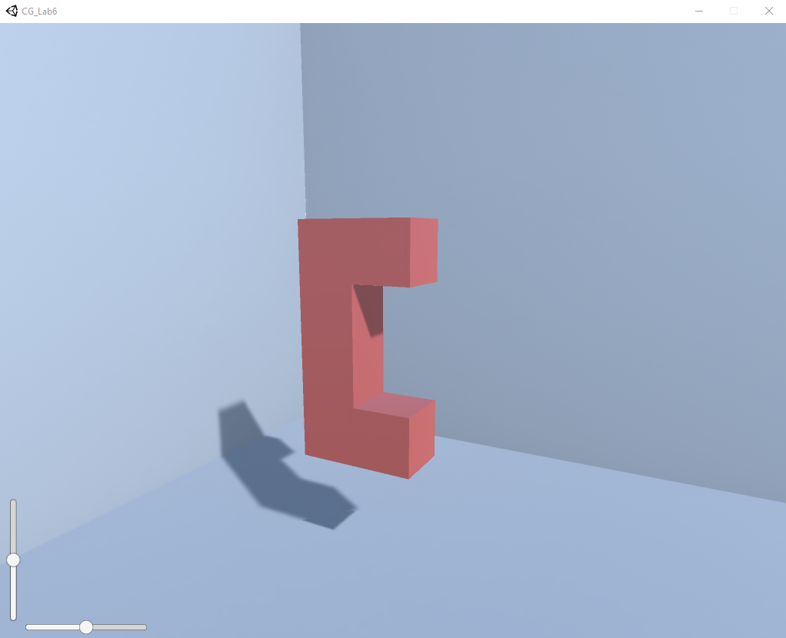
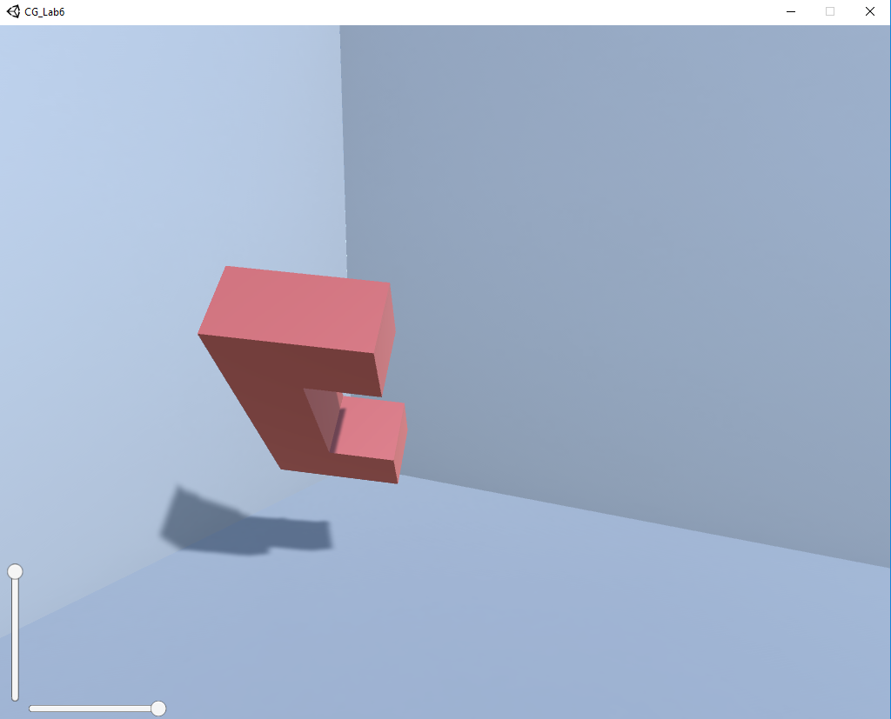

# Лабораторная работа 6
## Селедцов Денис
### Построение и визуализация трехмерных объектов

Реализовано на языке `C#` с использованием Unity.

## Руководство

Для запуска приложения требуется не только '.exe' файл, но и все прилагающиеся к нему файлы и папки.
Найти скомпилированный проект и нужные файлы можно [тут](https://drive.google.com/drive/folders/1fqeV9qJLqAHJ5Vbg7NrK0UbkG4eC4QGj?usp=sharing)
После запуска приложения мы увидим букву 'C', которую мы можем вращать с помощью мыши, а также перемещать по 4 направлениям,
используя слайдеры. 

