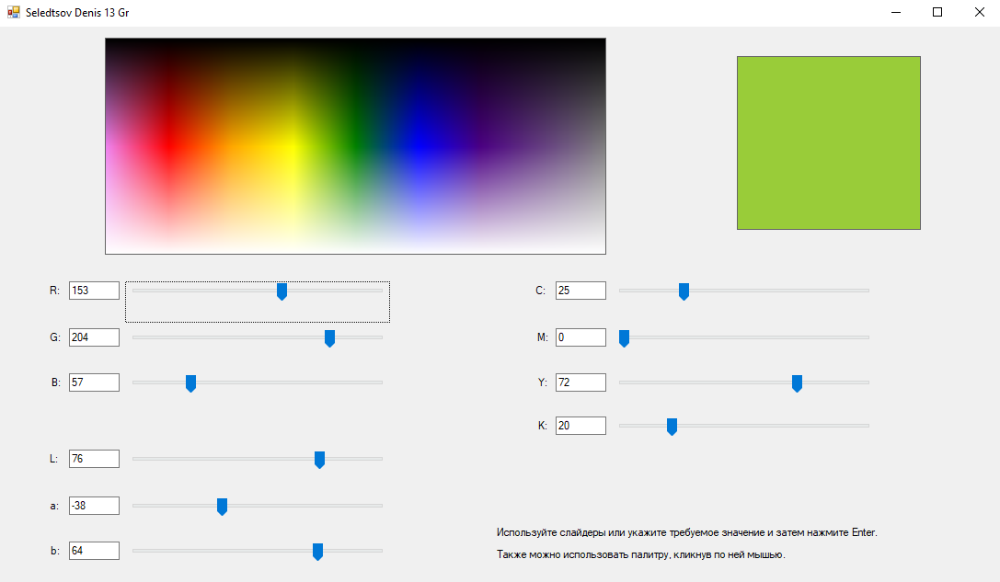

# Лабораторная работа 1
## Селедцов Денис
### Вариант 1, RGB <-> CMYK <-> LAB.

Реализовано на языке `C#` с использованием Windows Forms.

## Руководство

В интерфейсе для пользователя представлены различные возможности задания цветов. Используя поля ввода, а затем нажав Enter,
пользователь может точно задать значения цвета. Выбрать понравившийся ему цвет пользователь может из палитры. При надобности
плавно изменить значение доступны ползунки.

При изменении любой компоненты цвета все остальные представления этого цвета в двух других цветовых моделях пересчитываются
автоматически. А выбранный цвет отобразится на панели в правом верхнем углу.

Для избежания ввода некорректных значений, поля имеют свои ограничения на ввод.
