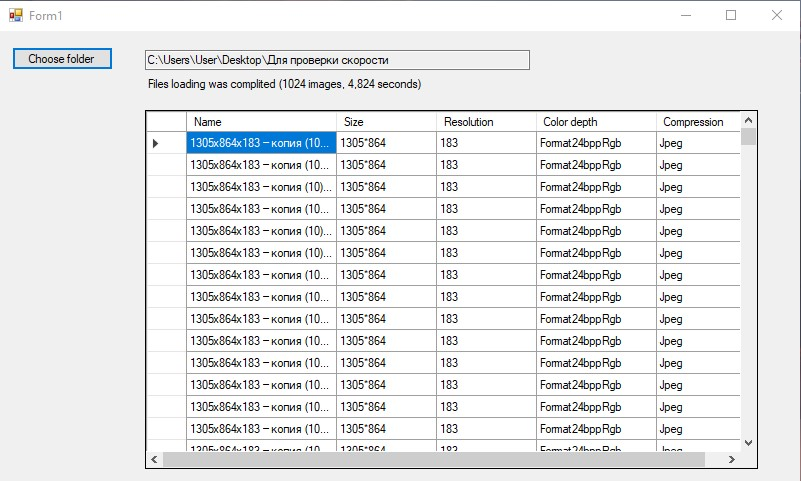

# Лабораторная работа 2
## Селедцов Денис
### Чтение информации из графических файлов.

Реализовано на языке `C#` с использованием Windows Forms.

## Руководство

При открытии приложения пользователю доступна кнопка, по нажатию которой, появляется окошко для выбора папки с графическими
файлами. После выбора папки и нажатия кнопки ОК, программа начинает обработку информаци, а путь к выбранной папке
отобразиться в соответствующем окошке. Вся собранная об изображениях информация затем выведется в таблицу с соответствующими
столюцами (Name, Size, Resolution, Color depth, Compression).

Для получения информации я воспользовался классом Bitmap, извлекая все нужные данные оттуда. Для обработки формата .pcx,
поддержка которого в `C#` отстутсвует, я воспользовался библиотекой Kaitai Struct.

Для ускорения обработки большого кол-ва информации, я использовал Parallel.For. 
Для синхронизации BlockingCollection<>, механизм lock.

Обработка 1024 .jpeg файлов общим размером 1.92ГБ занимает менее 5 секунд.
Подсчет времени осуществлялся с помощью `System.Diagnostics.Stopwatch`.
