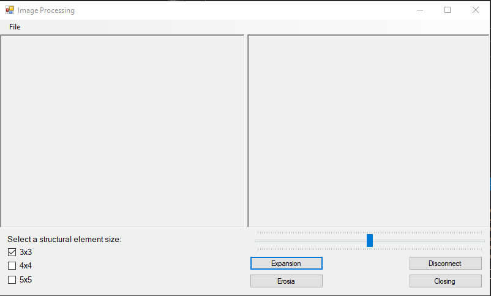
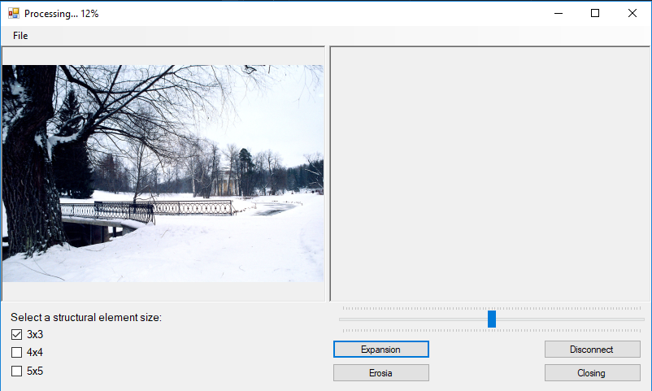
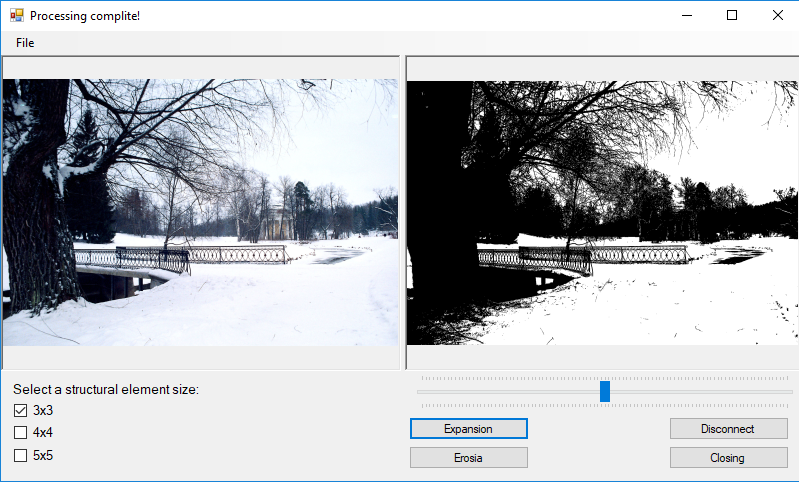

# Лабораторная работа 3
## Селедцов Денис. Вариант 19
### Основы обработки цифровых изображений.

Реализовано на языке `C#` с использованием Windows Forms.

## Руководство

При открытии приложения на верхней панеле доступна кнопка `File`, нажав на которую и, затем, выбрав `Open`, вы можете открыть
требуемое вами изображение. Далее начнется его загрузка и предварительная обработка (сегментация, перевод в черно-белое).
Прогресс обработки будет отображен в заголовке окна. После обработки появится надпись `Processing complite!`.

Для морфологической обработки доступны операции: наращивание(Expansion), эрозия(Erosia), размыкание(Disconnect),
замыкание(Closing). Процесс выполнения этих операций будет также отображаться в заголовке окна. Также для выбора доступен
размер структурного элемента (3х3, 4х4, 5х5).

В папке `Images` лежат изображения, на которых можно опробовать работу программы. 
