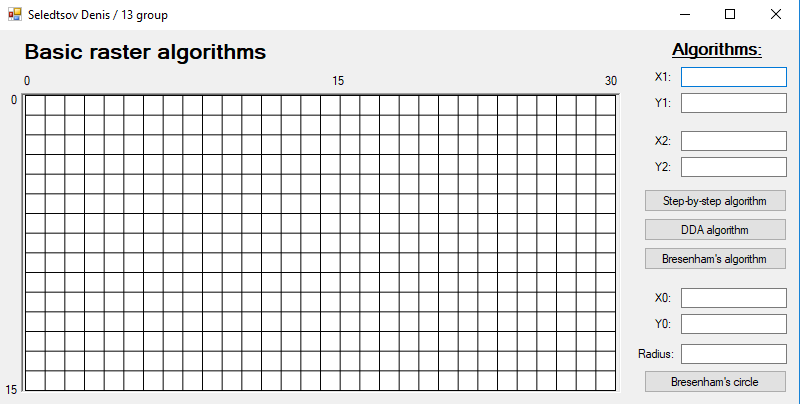
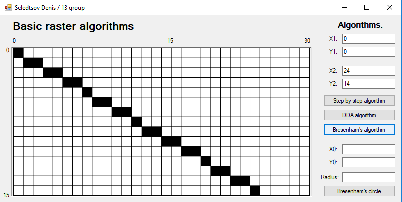
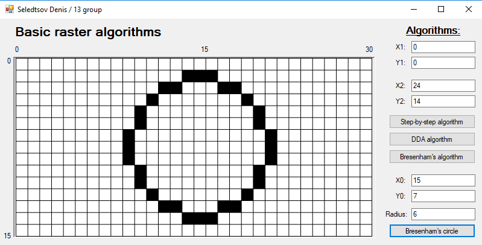

# Лабораторная работа 4
## Селедцов Денис.
### Базовые растровые алгоритмы

Реализовано на языке `C#` с использованием Windows Forms.



## Руководство

При открытии приложения пользователь видит поле, состоящее из клеток, размером 30*15 пикселей. Панель справа предоставляет 
различные алгоритмы для рисования линий (пошаговый, ЦДА, Брезенхейма), а также окружности (Брезенхейма). Введите координаты 
первой и второй точки в случае линии, и координаты центра окружности и её радиус в случае окружности. Доступные для ввода
значения находятся от 0 до 29 включительно для ширины и от 0 до 14 включительно для высоты. При вводе большего числа, 
оно будет приведено к максимально допустимому значению.



### Замеры скорости

Замеры выполнялись рисованием линии 10000 раз, с повтором 100 раз и нахождением среднего значения.

#### Алгоритмы:
- Пошаговый   - `34400нс`
- ЦДА         - `33974нс`
- Брезенхейма - `33795нс`

Таким образом, видим, что использование целочисленой арифметики в Брезенхейме оправдано и действительно имеет выигрыш 
в скорости. Пошаговый же, с частыми приведениями явно проигрывает двум другим.

### Пример построения линии методом ЦДА:

Линия из (0,0) в (4,3):
```bash
dx = 4
dy = 3

steps = 4

incX = 1
incY = 0.75

x = 0
y = 0

x += incX
y += incY

# x = 1; y = 0.75 (round to 1);
x += incX
y += incY

# x = 2; y = 1.5 (round to 2);
x += incX
y += incY

# x = 3; y = 2.25 (round to 2);
x += incX
y += incY

# x = 4; y = 3;
```
