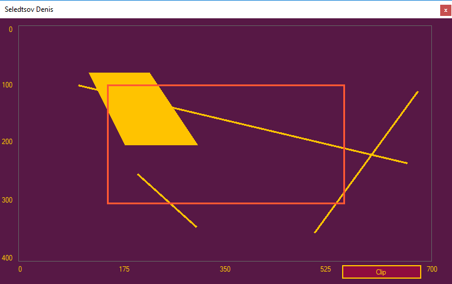
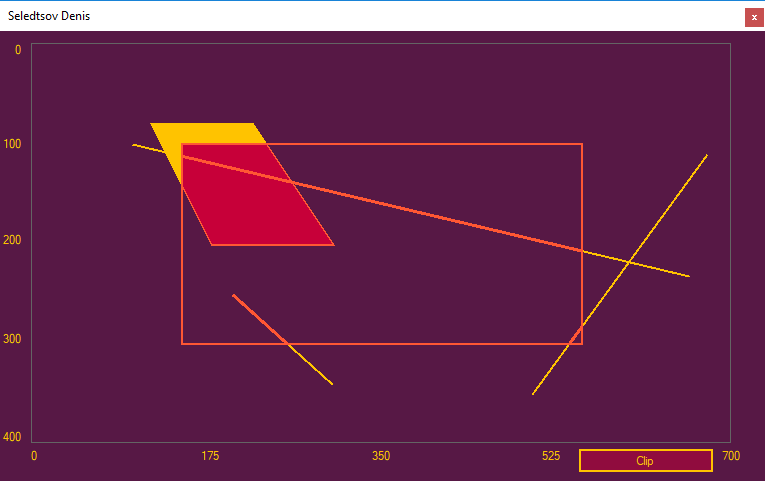
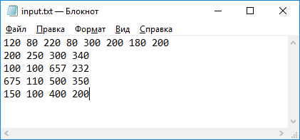

# Лабораторная работа 5
## Селедцов Денис. Вариант 19.
### Алгоритмы отсечения отрезков и многоугольников

Реализовано на языке `C#` с использованием Windows Forms.

## Руководство

Во время запуска приложения ищет в своей папке текстовый файл `input.txt`, содержащий координаты отрезков и многоугольников, а
последней записью координаты отсекающего окна. После нахождения данного файла - программа считывает фигуры и выводит их на экран.
По нажатию пользователем кнопки `Clip`, программа проводит отсечение фигур, оказавшихся за пределами заданного окна.

#### Алгоритмы:
- Сазерленда-Коэна
- Сазерленда-Ходгмана
